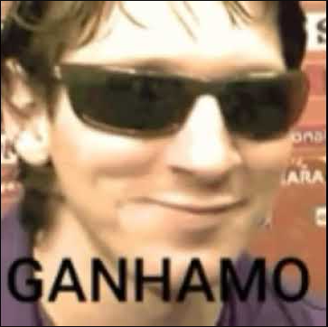

# Web Service OCR + Client TTS

 
 

Este projeto foi feito como parte do meu TCC da faculdade, tendo como principal função auxiliar a leitura de deficientes visuais (além de me ajudar a concluir a faculdade, claro 🤭)

## Detalhes

A aplicação possui fundamentalmente 2 partes:
- Uma web service feito para receber imagens e extrair o texto presente nelas por meio de um Optical Character Recognition (OCR), que no caso foi o [Tesseract](https://github.com/naptha/tesseract.js).
- Um protótipo de cliente para consumir esse web service e utilizar uma ferramenta Text To Speech (TTS) para ler o texto extraído da imagem. A ferramenta usada foi o [SpeechSynthesis](https://developer.mozilla.org/pt-BR/docs/Web/API/SpeechSynthesis), da Web Speech API.

Por intermédio dessas 2 partes a aplicação é capaz de ler o texto presente em imagens para o usuário, não havendo a necessidade do usuário saber ou conseguir ler.

Visto que o protótipo de aplicação cliente é apenas um protótipo (jura?) para demonstrar como seria a utilização de um TTS com o web service OCR, não foram aplicadas técnicas de acessibilidade para permitir a utilização por parte de pessoas com deficiências.

# 🎉🎊🎈 TIRAMO 10!!! 🎈🎊🎉

 
